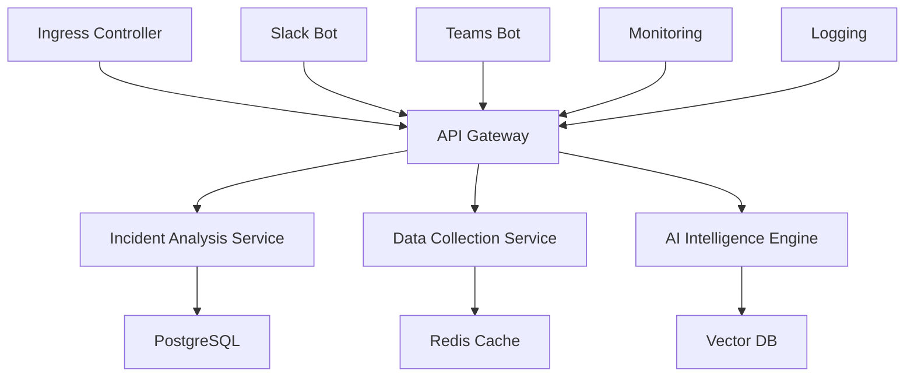

# Kubernetes Deployment

## Overview

This directory contains all Kubernetes manifests and Helm charts for deploying OpsSage in a production environment.

## Architecture



## Components

### 1. Namespace

```yaml
# deployment/kubernetes/namespace.yaml
apiVersion: v1
kind: Namespace
metadata:
  name: opssage
  labels:
    name: opssage
    environment: production
---
apiVersion: v1
kind: Namespace
metadata:
  name: opssage-staging
  labels:
    name: opssage-staging
    environment: staging
```

### 2. ConfigMaps

```yaml
# deployment/kubernetes/configmaps.yaml
apiVersion: v1
kind: ConfigMap
metadata:
  name: opssage-config
  namespace: opssage
data:
  NODE_ENV: "production"
  LOG_LEVEL: "info"
  API_BASE_URL: "https://api.opssage.io/v1"
  
  # Database Configuration
  DB_HOST: "postgresql.opssage.svc.cluster.local"
  DB_PORT: "5432"
  DB_NAME: "opssage"
  
  # Redis Configuration
  REDIS_HOST: "redis.opssage.svc.cluster.local"
  REDIS_PORT: "6379"
  
  # AI Configuration
  OPENAI_MODEL: "gpt-4"
  EMBEDDING_MODEL: "text-embedding-ada-002"
  
  # Integration Configuration
  DATADOG_SITE: "datadoghq.com"
  K8S_NAMESPACE: "opssage"
  
  # Monitoring Configuration
  METRICS_ENABLED: "true"
  TRACING_ENABLED: "true"
  
  # Security Configuration
  RATE_LIMIT_WINDOW: "60000"
  RATE_LIMIT_MAX: "100"
---
apiVersion: v1
kind: ConfigMap
metadata:
  name: opssage-prometheus-config
  namespace: opssage
data:
  prometheus.yml: |
    global:
      scrape_interval: 15s
      evaluation_interval: 15s
    
    rule_files:
      - "opssage_rules.yml"
    
    scrape_configs:
      - job_name: 'opssage-api'
        static_configs:
          - targets: ['api-gateway.opssage.svc.cluster.local:3000']
        metrics_path: /metrics
        scrape_interval: 30s
      
      - job_name: 'opssage-incident-service'
        static_configs:
          - targets: ['incident-analysis.opssage.svc.cluster.local:3001']
        metrics_path: /metrics
        scrape_interval: 30s
      
      - job_name: 'opssage-ai-engine'
        static_configs:
          - targets: ['ai-engine.opssage.svc.cluster.local:3002']
        metrics_path: /metrics
        scrape_interval: 30s
  
  opssage_rules.yml: |
    groups:
      - name: opssage.rules
        rules:
          - alert: HighErrorRate
            expr: rate(http_requests_total{status=~"5.."}[5m]) > 0.1
            for: 2m
            labels:
              severity: warning
            annotations:
              summary: "High error rate detected"
              description: "Error rate is {{ $value }} errors per second"
          
          - alert: HighLatency
            expr: histogram_quantile(0.95, rate(http_request_duration_seconds_bucket[5m])) > 1
            for: 5m
            labels:
              severity: warning
            annotations:
              summary: "High latency detected"
              description: "95th percentile latency is {{ $value }} seconds"
          
          - alert: ServiceDown
            expr: up == 0
            for: 1m
            labels:
              severity: critical
            annotations:
              summary: "Service is down"
              description: "Service {{ $labels.job }} has been down for more than 1 minute"
```

### 3. Secrets

```yaml
# deployment/kubernetes/secrets.yaml
apiVersion: v1
kind: Secret
metadata:
  name: opssage-secrets
  namespace: opssage
type: Opaque
data:
  # Base64 encoded values
  DATABASE_PASSWORD: <base64-encoded-password>
  REDIS_PASSWORD: <base64-encoded-password>
  JWT_SECRET: <base64-encoded-jwt-secret>
  
  # OpenAI Configuration
  OPENAI_API_KEY: <base64-encoded-openai-key>
  
  # Datadog Configuration
  DATADOG_API_KEY: <base64-encoded-datadog-key>
  DATADOG_APP_KEY: <base64-encoded-datadog-app-key>
  
  # Slack Configuration
  SLACK_BOT_TOKEN: <base64-encoded-slack-token>
  SLACK_SIGNING_SECRET: <base64-encoded-slack-secret>
  SLACK_APP_TOKEN: <base64-encoded-slack-app-token>
  
  # Teams Configuration
  TEAMS_BOT_ID: <base64-encoded-teams-bot-id>
  TEAMS_BOT_PASSWORD: <base64-encoded-teams-bot-password>
  
  # PagerDuty Configuration
  PAGERDUTY_API_TOKEN: <base64-encoded-pagerduty-token>
  
  # Vector DB Configuration
  PINECONE_API_KEY: <base64-encoded-pinecone-key>
  PINECONE_ENVIRONMENT: <base64-encoded-pinecone-env>
```

### 4. Services

```yaml
# deployment/kubernetes/services.yaml
apiVersion: v1
kind: Service
metadata:
  name: api-gateway
  namespace: opssage
  labels:
    app: api-gateway
    component: gateway
spec:
  selector:
    app: api-gateway
  ports:
    - name: http
      port: 3000
      targetPort: 3000
      protocol: TCP
  type: ClusterIP
---
apiVersion: v1
kind: Service
metadata:
  name: incident-analysis
  namespace: opssage
  labels:
    app: incident-analysis
    component: analysis
spec:
  selector:
    app: incident-analysis
  ports:
    - name: http
      port: 3001
      targetPort: 3001
      protocol: TCP
  type: ClusterIP
---
apiVersion: v1
kind: Service
metadata:
  name: data-collection
  namespace: opssage
  labels:
    app: data-collection
    component: collector
spec:
  selector:
    app: data-collection
  ports:
    - name: http
      port: 3002
      targetPort: 3002
      protocol: TCP
  type: ClusterIP
---
apiVersion: v1
kind: Service
metadata:
  name: ai-engine
  namespace: opssage
  labels:
    app: ai-engine
    component: ai
spec:
  selector:
    app: ai-engine
  ports:
    - name: http
      port: 3003
      targetPort: 3003
      protocol: TCP
  type: ClusterIP
---
apiVersion: v1
kind: Service
metadata:
  name: postgresql
  namespace: opssage
  labels:
    app: postgresql
    component: database
spec:
  selector:
    app: postgresql
  ports:
    - name: postgresql
      port: 5432
      targetPort: 5432
      protocol: TCP
  type: ClusterIP
---
apiVersion: v1
kind: Service
metadata:
  name: redis
  namespace: opssage
  labels:
    app: redis
    component: cache
spec:
  selector:
    app: redis
  ports:
    - name: redis
      port: 6379
      targetPort: 6379
      protocol: TCP
  type: ClusterIP
```

### 5. Deployments

```yaml
# deployment/kubernetes/deployments.yaml
apiVersion: apps/v1
kind: Deployment
metadata:
  name: api-gateway
  namespace: opssage
  labels:
    app: api-gateway
    component: gateway
spec:
  replicas: 3
  selector:
    matchLabels:
      app: api-gateway
  template:
    metadata:
      labels:
        app: api-gateway
        component: gateway
    spec:
      containers:
      - name: api-gateway
        image: opssage/api-gateway:latest
        ports:
        - containerPort: 3000
        env:
        - name: PORT
          value: "3000"
        - name: NODE_ENV
          valueFrom:
            configMapKeyRef:
              name: opssage-config
              key: NODE_ENV
        - name: DATABASE_URL
          value: "postgresql://$(DATABASE_USER):$(DATABASE_PASSWORD)@$(DB_HOST):$(DB_PORT)/$(DB_NAME)"
        - name: DATABASE_USER
          value: "opssage"
        - name: DATABASE_PASSWORD
          valueFrom:
            secretKeyRef:
              name: opssage-secrets
              key: DATABASE_PASSWORD
        - name: DB_HOST
          valueFrom:
            configMapKeyRef:
              name: opssage-config
              key: DB_HOST
        - name: DB_PORT
          valueFrom:
            configMapKeyRef:
              name: opssage-config
              key: DB_PORT
        - name: DB_NAME
          valueFrom:
            configMapKeyRef:
              name: opssage-config
              key: DB_NAME
        - name: REDIS_URL
          value: "redis://$(REDIS_HOST):$(REDIS_PORT)"
        - name: REDIS_HOST
          valueFrom:
            configMapKeyRef:
              name: opssage-config
              key: REDIS_HOST
        - name: REDIS_PORT
          valueFrom:
            configMapKeyRef:
              name: opssage-config
              key: REDIS_PORT
        - name: JWT_SECRET
          valueFrom:
            secretKeyRef:
              name: opssage-secrets
              key: JWT_SECRET
        - name: OPENAI_API_KEY
          valueFrom:
            secretKeyRef:
              name: opssage-secrets
              key: OPENAI_API_KEY
        - name: DATADOG_API_KEY
          valueFrom:
            secretKeyRef:
              name: opssage-secrets
              key: DATADOG_API_KEY
        - name: DATADOG_APP_KEY
          valueFrom:
            secretKeyRef:
              name: opssage-secrets
              key: DATADOG_APP_KEY
        - name: SLACK_BOT_TOKEN
          valueFrom:
            secretKeyRef:
              name: opssage-secrets
              key: SLACK_BOT_TOKEN
        - name: SLACK_SIGNING_SECRET
          valueFrom:
            secretKeyRef:
              name: opssage-secrets
              key: SLACK_SIGNING_SECRET
        resources:
          requests:
            memory: "256Mi"
            cpu: "250m"
          limits:
            memory: "512Mi"
            cpu: "500m"
        livenessProbe:
          httpGet:
            path: /health
            port: 3000
          initialDelaySeconds: 30
          periodSeconds: 10
        readinessProbe:
          httpGet:
            path: /ready
            port: 3000
          initialDelaySeconds: 5
          periodSeconds: 5
---
apiVersion: apps/v1
kind: Deployment
metadata:
  name: incident-analysis
  namespace: opssage
  labels:
    app: incident-analysis
    component: analysis
spec:
  replicas: 2
  selector:
    matchLabels:
      app: incident-analysis
  template:
    metadata:
      labels:
        app: incident-analysis
        component: analysis
    spec:
      containers:
      - name: incident-analysis
        image: opssage/incident-analysis:latest
        ports:
        - containerPort: 3001
        env:
        - name: PORT
          value: "3001"
        - name: NODE_ENV
          valueFrom:
            configMapKeyRef:
              name: opssage-config
              key: NODE_ENV
        - name: DATABASE_URL
          value: "postgresql://$(DATABASE_USER):$(DATABASE_PASSWORD)@$(DB_HOST):$(DB_PORT)/$(DB_NAME)"
        - name: DATABASE_USER
          value: "opssage"
        - name: DATABASE_PASSWORD
          valueFrom:
            secretKeyRef:
              name: opssage-secrets
              key: DATABASE_PASSWORD
        - name: DB_HOST
          valueFrom:
            configMapKeyRef:
              name: opssage-config
              key: DB_HOST
        - name: DB_PORT
          valueFrom:
            configMapKeyRef:
              name: opssage-config
              key: DB_PORT
        - name: DB_NAME
          valueFrom:
            configMapKeyRef:
              name: opssage-config
              key: DB_NAME
        - name: REDIS_URL
          value: "redis://$(REDIS_HOST):$(REDIS_PORT)"
        - name: REDIS_HOST
          valueFrom:
            configMapKeyRef:
              name: opssage-config
              key: REDIS_HOST
        - name: REDIS_PORT
          valueFrom:
            configMapKeyRef:
              name: opssage-config
              key: REDIS_PORT
        - name: OPENAI_API_KEY
          valueFrom:
            secretKeyRef:
              name: opssage-secrets
              key: OPENAI_API_KEY
        - name: PINECONE_API_KEY
          valueFrom:
            secretKeyRef:
              name: opssage-secrets
              key: PINECONE_API_KEY
        resources:
          requests:
            memory: "512Mi"
            cpu: "500m"
          limits:
            memory: "1Gi"
            cpu: "1000m"
        livenessProbe:
          httpGet:
            path: /health
            port: 3001
          initialDelaySeconds: 30
          periodSeconds: 10
        readinessProbe:
          httpGet:
            path: /ready
            port: 3001
          initialDelaySeconds: 5
          periodSeconds: 5
---
apiVersion: apps/v1
kind: Deployment
metadata:
  name: data-collection
  namespace: opssage
  labels:
    app: data-collection
    component: collector
spec:
  replicas: 2
  selector:
    matchLabels:
      app: data-collection
  template:
    metadata:
      labels:
        app: data-collection
        component: collector
    spec:
      containers:
      - name: data-collection
        image: opssage/data-collection:latest
        ports:
        - containerPort: 3002
        env:
        - name: PORT
          value: "3002"
        - name: NODE_ENV
          valueFrom:
            configMapKeyRef:
              name: opssage-config
              key: NODE_ENV
        - name: DATADOG_API_KEY
          valueFrom:
            secretKeyRef:
              name: opssage-secrets
              key: DATADOG_API_KEY
        - name: DATADOG_APP_KEY
          valueFrom:
            secretKeyRef:
              name: opssage-secrets
              key: DATADOG_APP_KEY
        - name: DATADOG_SITE
          valueFrom:
            configMapKeyRef:
              name: opssage-config
              key: DATADOG_SITE
        - name: K8S_NAMESPACE
          valueFrom:
            configMapKeyRef:
              name: opssage-config
              key: K8S_NAMESPACE
        - name: PAGERDUTY_API_TOKEN
          valueFrom:
            secretKeyRef:
              name: opssage-secrets
              key: PAGERDUTY_API_TOKEN
        resources:
          requests:
            memory: "256Mi"
            cpu: "250m"
          limits:
            memory: "512Mi"
            cpu: "500m"
        livenessProbe:
          httpGet:
            path: /health
            port: 3002
          initialDelaySeconds: 30
          periodSeconds: 10
        readinessProbe:
          httpGet:
            path: /ready
            port: 3002
          initialDelaySeconds: 5
          periodSeconds: 5
---
apiVersion: apps/v1
kind: Deployment
metadata:
  name: ai-engine
  namespace: opssage
  labels:
    app: ai-engine
    component: ai
spec:
  replicas: 2
  selector:
    matchLabels:
      app: ai-engine
  template:
    metadata:
      labels:
        app: ai-engine
        component: ai
    spec:
      containers:
      - name: ai-engine
        image: opssage/ai-engine:latest
        ports:
        - containerPort: 3003
        env:
        - name: PORT
          value: "3003"
        - name: NODE_ENV
          valueFrom:
            configMapKeyRef:
              name: opssage-config
              key: NODE_ENV
        - name: OPENAI_API_KEY
          valueFrom:
            secretKeyRef:
              name: opssage-secrets
              key: OPENAI_API_KEY
        - name: OPENAI_MODEL
          valueFrom:
            configMapKeyRef:
              name: opssage-config
              key: OPENAI_MODEL
        - name: EMBEDDING_MODEL
          valueFrom:
            configMapKeyRef:
              name: opssage-config
              key: EMBEDDING_MODEL
        - name: PINECONE_API_KEY
          valueFrom:
            secretKeyRef:
              name: opssage-secrets
              key: PINECONE_API_KEY
        - name: PINECONE_ENVIRONMENT
          valueFrom:
            secretKeyRef:
              name: opssage-secrets
              key: PINECONE_ENVIRONMENT
        - name: REDIS_URL
          value: "redis://$(REDIS_HOST):$(REDIS_PORT)"
        - name: REDIS_HOST
          valueFrom:
            configMapKeyRef:
              name: opssage-config
              key: REDIS_HOST
        - name: REDIS_PORT
          valueFrom:
            configMapKeyRef:
              name: opssage-config
              key: REDIS_PORT
        resources:
          requests:
            memory: "1Gi"
            cpu: "1000m"
          limits:
            memory: "2Gi"
            cpu: "2000m"
        livenessProbe:
          httpGet:
            path: /health
            port: 3003
          initialDelaySeconds: 30
          periodSeconds: 10
        readinessProbe:
          httpGet:
            path: /ready
            port: 3003
          initialDelaySeconds: 5
          periodSeconds: 5
```

### 6. StatefulSets

```yaml
# deployment/kubernetes/statefulsets.yaml
apiVersion: apps/v1
kind: StatefulSet
metadata:
  name: postgresql
  namespace: opssage
  labels:
    app: postgresql
    component: database
spec:
  serviceName: postgresql
  replicas: 1
  selector:
    matchLabels:
      app: postgresql
  template:
    metadata:
      labels:
        app: postgresql
        component: database
    spec:
      containers:
      - name: postgresql
        image: postgres:14
        ports:
        - containerPort: 5432
        env:
        - name: POSTGRES_DB
          valueFrom:
            configMapKeyRef:
              name: opssage-config
              key: DB_NAME
        - name: POSTGRES_USER
          value: "opssage"
        - name: POSTGRES_PASSWORD
          valueFrom:
            secretKeyRef:
              name: opssage-secrets
              key: DATABASE_PASSWORD
        - name: PGDATA
          value: /var/lib/postgresql/data/pgdata
        resources:
          requests:
            memory: "1Gi"
            cpu: "500m"
          limits:
            memory: "2Gi"
            cpu: "1000m"
        volumeMounts:
        - name: postgresql-storage
          mountPath: /var/lib/postgresql/data
        livenessProbe:
          exec:
            command:
            - pg_isready
            - -U
            - opssage
          initialDelaySeconds: 30
          periodSeconds: 10
        readinessProbe:
          exec:
            command:
            - pg_isready
            - -U
            - opssage
          initialDelaySeconds: 5
          periodSeconds: 5
  volumeClaimTemplates:
  - metadata:
      name: postgresql-storage
    spec:
      accessModes: ["ReadWriteOnce"]
      storageClassName: "fast-ssd"
      resources:
        requests:
          storage: 20Gi
---
apiVersion: apps/v1
kind: StatefulSet
metadata:
  name: redis
  namespace: opssage
  labels:
    app: redis
    component: cache
spec:
  serviceName: redis
  replicas: 1
  selector:
    matchLabels:
      app: redis
  template:
    metadata:
      labels:
        app: redis
        component: cache
    spec:
      containers:
      - name: redis
        image: redis:7-alpine
        ports:
        - containerPort: 6379
        command:
        - redis-server
        - --requirepass
        - $(REDIS_PASSWORD)
        env:
        - name: REDIS_PASSWORD
          valueFrom:
            secretKeyRef:
              name: opssage-secrets
              key: REDIS_PASSWORD
        resources:
          requests:
            memory: "256Mi"
            cpu: "250m"
          limits:
            memory: "512Mi"
            cpu: "500m"
        volumeMounts:
        - name: redis-storage
          mountPath: /data
        livenessProbe:
          exec:
            command:
            - redis-cli
            - ping
          initialDelaySeconds: 30
          periodSeconds: 10
        readinessProbe:
          exec:
            command:
            - redis-cli
            - ping
          initialDelaySeconds: 5
          periodSeconds: 5
  volumeClaimTemplates:
  - metadata:
      name: redis-storage
    spec:
      accessModes: ["ReadWriteOnce"]
      storageClassName: "fast-ssd"
      resources:
        requests:
          storage: 5Gi
```

### 7. Ingress

```yaml
# deployment/kubernetes/ingress.yaml
apiVersion: networking.k8s.io/v1
kind: Ingress
metadata:
  name: opssage-ingress
  namespace: opssage
  annotations:
    kubernetes.io/ingress.class: "nginx"
    cert-manager.io/cluster-issuer: "letsencrypt-prod"
    nginx.ingress.kubernetes.io/ssl-redirect: "true"
    nginx.ingress.kubernetes.io/use-regex: "true"
    nginx.ingress.kubernetes.io/rewrite-target: /$2
    nginx.ingress.kubernetes.io/rate-limit: "100"
    nginx.ingress.kubernetes.io/rate-limit-window: "1m"
spec:
  tls:
  - hosts:
    - api.opssage.io
    secretName: opssage-tls
  rules:
  - host: api.opssage.io
    http:
      paths:
      - path: /api/v1(/|$)(.*)
        pathType: Prefix
        backend:
          service:
            name: api-gateway
            port:
              number: 3000
      - path: /webhooks/slack
        pathType: Prefix
        backend:
          service:
            name: api-gateway
            port:
              number: 3000
      - path: /webhooks/teams
        pathType: Prefix
        backend:
          service:
            name: api-gateway
            port:
              number: 3000
---
apiVersion: networking.k8s.io/v1
kind: Ingress
metadata:
  name: opssage-monitoring
  namespace: opssage
  annotations:
    kubernetes.io/ingress.class: "nginx"
    nginx.ingress.kubernetes.io/ssl-redirect: "true"
    nginx.ingress.kubernetes.io/auth-type: "basic"
    nginx.ingress.kubernetes.io/auth-secret: "opssage-monitoring-auth"
spec:
  tls:
  - hosts:
    - monitoring.opssage.io
    secretName: opssage-monitoring-tls
  rules:
  - host: monitoring.opssage.io
    http:
      paths:
      - path: /
        pathType: Prefix
        backend:
          service:
            name: prometheus
            port:
              number: 9090
```

### 8. Horizontal Pod Autoscalers

```yaml
# deployment/kubernetes/hpa.yaml
apiVersion: autoscaling/v2
kind: HorizontalPodAutoscaler
metadata:
  name: api-gateway-hpa
  namespace: opssage
spec:
  scaleTargetRef:
    apiVersion: apps/v1
    kind: Deployment
    name: api-gateway
  minReplicas: 3
  maxReplicas: 10
  metrics:
  - type: Resource
    resource:
      name: cpu
      target:
        type: Utilization
        averageUtilization: 70
  - type: Resource
    resource:
      name: memory
      target:
        type: Utilization
        averageUtilization: 80
  behavior:
    scaleDown:
      stabilizationWindowSeconds: 300
      policies:
      - type: Percent
        value: 10
        periodSeconds: 60
    scaleUp:
      stabilizationWindowSeconds: 60
      policies:
      - type: Percent
        value: 50
        periodSeconds: 60
---
apiVersion: autoscaling/v2
kind: HorizontalPodAutoscaler
metadata:
  name: incident-analysis-hpa
  namespace: opssage
spec:
  scaleTargetRef:
    apiVersion: apps/v1
    kind: Deployment
    name: incident-analysis
  minReplicas: 2
  maxReplicas: 8
  metrics:
  - type: Resource
    resource:
      name: cpu
      target:
        type: Utilization
        averageUtilization: 70
  - type: Resource
    resource:
      name: memory
      target:
        type: Utilization
        averageUtilization: 80
---
apiVersion: autoscaling/v2
kind: HorizontalPodAutoscaler
metadata:
  name: data-collection-hpa
  namespace: opssage
spec:
  scaleTargetRef:
    apiVersion: apps/v1
    kind: Deployment
    name: data-collection
  minReplicas: 2
  maxReplicas: 6
  metrics:
  - type: Resource
    resource:
      name: cpu
      target:
        type: Utilization
        averageUtilization: 70
---
apiVersion: autoscaling/v2
kind: HorizontalPodAutoscaler
metadata:
  name: ai-engine-hpa
  namespace: opssage
spec:
  scaleTargetRef:
    apiVersion: apps/v1
    kind: Deployment
    name: ai-engine
  minReplicas: 2
  maxReplicas: 6
  metrics:
  - type: Resource
    resource:
      name: cpu
      target:
        type: Utilization
        averageUtilization: 80
  - type: Resource
    resource:
      name: memory
      target:
        type: Utilization
        averageUtilization: 85
```

### 9. Network Policies

```yaml
# deployment/kubernetes/network-policies.yaml
apiVersion: networking.k8s.io/v1
kind: NetworkPolicy
metadata:
  name: opssage-network-policy
  namespace: opssage
spec:
  podSelector: {}
  policyTypes:
  - Ingress
  - Egress
  ingress:
  - from:
    - namespaceSelector:
        matchLabels:
          name: ingress-nginx
    - podSelector:
        matchLabels:
          app: api-gateway
    ports:
    - protocol: TCP
      port: 3000
    - protocol: TCP
      port: 3001
    - protocol: TCP
      port: 3002
    - protocol: TCP
      port: 3003
  - from:
    - podSelector:
        matchLabels:
          app: api-gateway
    - podSelector:
        matchLabels:
          app: incident-analysis
    - podSelector:
        matchLabels:
          app: data-collection
    - podSelector:
        matchLabels:
          app: ai-engine
    ports:
    - protocol: TCP
      port: 5432
    - protocol: TCP
      port: 6379
  egress:
  - to:
    - namespaceSelector:
        matchLabels:
          name: kube-system
    ports:
    - protocol: TCP
      port: 53
    - protocol: UDP
      port: 53
  - to: []
    ports:
    - protocol: TCP
      port: 443
    - protocol: TCP
      port: 80
```

### 10. Service Monitors (Prometheus Operator)

```yaml
# deployment/kubernetes/service-monitors.yaml
apiVersion: monitoring.coreos.com/v1
kind: ServiceMonitor
metadata:
  name: opssage-api-gateway
  namespace: opssage
  labels:
    app: api-gateway
spec:
  selector:
    matchLabels:
      app: api-gateway
  endpoints:
  - port: http
    path: /metrics
    interval: 30s
---
apiVersion: monitoring.coreos.com/v1
kind: ServiceMonitor
metadata:
  name: opssage-incident-analysis
  namespace: opssage
  labels:
    app: incident-analysis
spec:
  selector:
    matchLabels:
      app: incident-analysis
  endpoints:
  - port: http
    path: /metrics
    interval: 30s
---
apiVersion: monitoring.coreos.com/v1
kind: ServiceMonitor
metadata:
  name: opssage-data-collection
  namespace: opssage
  labels:
    app: data-collection
spec:
  selector:
    matchLabels:
      app: data-collection
  endpoints:
  - port: http
    path: /metrics
    interval: 30s
---
apiVersion: monitoring.coreos.com/v1
kind: ServiceMonitor
metadata:
  name: opssage-ai-engine
  namespace: opssage
  labels:
    app: ai-engine
spec:
  selector:
    matchLabels:
      app: ai-engine
  endpoints:
  - port: http
    path: /metrics
    interval: 30s
```

##  Deployment Commands

### Apply All Manifests

```bash
# Create namespaces
kubectl apply -f deployment/kubernetes/namespace.yaml

# Apply secrets (update with your values first)
kubectl apply -f deployment/kubernetes/secrets.yaml

# Apply configmaps
kubectl apply -f deployment/kubernetes/configmaps.yaml

# Apply storage classes (if needed)
kubectl apply -f deployment/kubernetes/storage-classes.yaml

# Apply statefulsets (databases)
kubectl apply -f deployment/kubernetes/statefulsets.yaml

# Wait for databases to be ready
kubectl wait --for=condition=ready pod -l app=postgresql -n opssage --timeout=300s
kubectl wait --for=condition=ready pod -l app=redis -n opssage --timeout=300s

# Apply services
kubectl apply -f deployment/kubernetes/services.yaml

# Apply deployments
kubectl apply -f deployment/kubernetes/deployments.yaml

# Apply ingress
kubectl apply -f deployment/kubernetes/ingress.yaml

# Apply HPAs
kubectl apply -f deployment/kubernetes/hpa.yaml

# Apply network policies
kubectl apply -f deployment/kubernetes/network-policies.yaml

# Apply service monitors
kubectl apply -f deployment/kubernetes/service-monitors.yaml
```

### Verify Deployment

```bash
# Check all pods
kubectl get pods -n opssage

# Check services
kubectl get services -n opssage

# Check ingress
kubectl get ingress -n opssage

# Check HPA status
kubectl get hpa -n opssage

# Check logs
kubectl logs -f deployment/api-gateway -n opssage
kubectl logs -f deployment/incident-analysis -n opssage
kubectl logs -f deployment/data-collection -n opssage
kubectl logs -f deployment/ai-engine -n opssage

# Port forward for local testing
kubectl port-forward service/api-gateway 3000:3000 -n opssage
```

##  Configuration Management

### Environment-Specific Values

```bash
# Development
kubectl apply -f deployment/kubernetes/overlays/development/

# Staging
kubectl apply -f deployment/kubernetes/overlays/staging/

# Production
kubectl apply -f deployment/kubernetes/overlays/production/
```

### Rolling Updates

```bash
# Update specific service
kubectl set image deployment/api-gateway api-gateway=opssage/api-gateway:v1.2.0 -n opssage

# Check rollout status
kubectl rollout status deployment/api-gateway -n opssage

# Rollback if needed
kubectl rollout undo deployment/api-gateway -n opssage
```

##  Monitoring & Observability

### Prometheus Metrics

```bash
# Access Prometheus
kubectl port-forward service/prometheus 9090:9090 -n opssage

# Check targets
curl http://localhost:9090/api/v1/targets

# Query metrics
curl 'http://localhost:9090/api/v1/query?query=up'
```

### Grafana Dashboards

```bash
# Access Grafana
kubectl port-forward service/grafana 3000:3000 -n opssage

# Import dashboards
kubectl apply -f deployment/kubernetes/monitoring/grafana-dashboards.yaml
```

## 🔒 Security Considerations

### Pod Security Policies

```yaml
# deployment/kubernetes/pod-security-policy.yaml
apiVersion: policy/v1beta1
kind: PodSecurityPolicy
metadata:
  name: opssage-psp
spec:
  privileged: false
  allowPrivilegeEscalation: false
  requiredDropCapabilities:
    - ALL
  volumes:
    - 'configMap'
    - 'emptyDir'
    - 'projected'
    - 'secret'
    - 'downwardAPI'
    - 'persistentVolumeClaim'
  runAsUser:
    rule: 'MustRunAsNonRoot'
  seLinux:
    rule: 'RunAsAny'
  fsGroup:
    rule: 'RunAsAny'
```

### RBAC

```yaml
# deployment/kubernetes/rbac.yaml
apiVersion: v1
kind: ServiceAccount
metadata:
  name: opssage
  namespace: opssage
---
apiVersion: rbac.authorization.k8s.io/v1
kind: Role
metadata:
  name: opssage-role
  namespace: opssage
rules:
- apiGroups: [""]
  resources: ["pods", "services", "endpoints"]
  verbs: ["get", "list", "watch"]
- apiGroups: [""]
  resources: ["events"]
  verbs: ["get", "list"]
- apiGroups: ["apps"]
  resources: ["deployments", "replicasets"]
  verbs: ["get", "list", "watch"]
---
apiVersion: rbac.authorization.k8s.io/v1
kind: RoleBinding
metadata:
  name: opssage-rolebinding
  namespace: opssage
subjects:
- kind: ServiceAccount
  name: opssage
  namespace: opssage
roleRef:
  kind: Role
  name: opssage-role
  apiGroup: rbac.authorization.k8s.io
```

##  Troubleshooting

### Common Issues

```bash
# Pod not starting
kubectl describe pod <pod-name> -n opssage

# Service not accessible
kubectl get endpoints -n opssage
kubectl describe service <service-name> -n opssage

# Ingress not working
kubectl describe ingress opssage-ingress -n opssage
kubectl logs -n ingress-nginx <nginx-pod>

# Database connection issues
kubectl logs -l app=postgresql -n opssage
kubectl exec -it postgresql-0 -n opssage -- psql -U opssage -d opssage

# Redis connection issues
kubectl logs -l app=redis -n opssage
kubectl exec -it redis-0 -n opssage -- redis-cli ping
```

### Performance Tuning

```yaml
# Resource limits adjustment
resources:
  requests:
    memory: "512Mi"
    cpu: "500m"
  limits:
    memory: "1Gi"
    cpu: "1000m"

# HPA thresholds adjustment
metrics:
- type: Resource
  resource:
    name: cpu
    target:
      type: Utilization
      averageUtilization: 60
```
