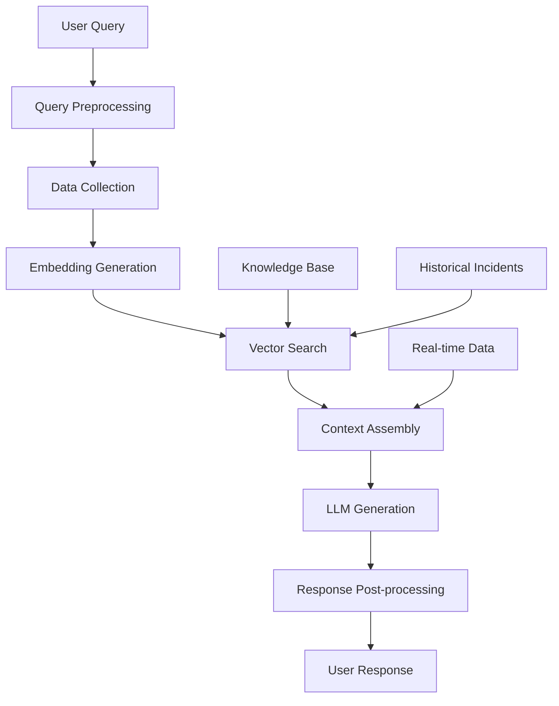

# AI Pipeline Design - RAG Architecture

##  Overview

The OpsSage AI Pipeline uses a Retrieval-Augmented Generation (RAG) architecture to provide intelligent incident analysis with real-time data aggregation and historical context.

##  RAG Architecture



##  Pipeline Components

### 1. Query Preprocessing Layer

```typescript
class QueryPreprocessor {
  private nlpService: NLPService;
  private entityExtractor: EntityExtractor;
  
  async preprocess(query: string, context: IncidentContext): Promise<ProcessedQuery> {
    // 1. Intent Recognition
    const intent = await this.nlpService.detectIntent(query);
    
    // 2. Entity Extraction
    const entities = await this.entityExtractor.extract(query);
    
    // 3. Query Expansion
    const expandedQuery = await this.expandQuery(query, entities);
    
    // 4. Context Enrichment
    const enrichedContext = await this.enrichContext(context, entities);
    
    return {
      originalQuery: query,
      intent,
      entities,
      expandedQuery,
      context: enrichedContext
    };
  }
  
  private async expandQuery(query: string, entities: ExtractedEntities): Promise<string> {
    // Add synonyms and related terms
    const expansions = await this.getSynonyms(entities.services);
    return `${query} ${expansions.join(' ')}`;
  }
}

interface ProcessedQuery {
  originalQuery: string;
  intent: 'analyze' | 'summarize' | 'suggest' | 'compare';
  entities: ExtractedEntities;
  expandedQuery: string;
  context: EnrichedContext;
}

interface ExtractedEntities {
  services: string[];
  errorTypes: string[];
  timeRanges: TimeRange[];
  severities: string[];
  metrics: string[];
}
```

### 2. Data Collection Layer

```typescript
class DataCollectionLayer {
  private collectors: Map<string, DataCollector>;
  private aggregator: DataAggregator;
  
  async collect(processedQuery: ProcessedQuery): Promise<CollectedData> {
    const collectionPromises = [];
    
    // Collect based on entities and context
    if (processedQuery.entities.services.length > 0) {
      collectionPromises.push(this.collectServiceData(processedQuery));
    }
    
    if (processedQuery.entities.timeRanges.length > 0) {
      collectionPromises.push(this.collectTimeSeriesData(processedQuery));
    }
    
    // Always collect recent incident data
    collectionPromises.push(this.collectRecentIncidents(processedQuery));
    
    const results = await Promise.allSettled(collectionPromises);
    return this.aggregator.aggregate(results);
  }
  
  private async collectServiceData(query: ProcessedQuery): Promise<ServiceData> {
    const serviceData = new Map<string, any>();
    
    for (const service of query.entities.services) {
      const [logs, metrics, traces, events] = await Promise.all([
        this.collectors.get('datadog')?.getLogs(service, query.context.timeRange),
        this.collectors.get('datadog')?.getMetrics(service, query.context.timeRange),
        this.collectors.get('datadog')?.getTraces(service, query.context.timeRange),
        this.collectors.get('kubernetes')?.getEvents(service, query.context.timeRange)
      ]);
      
      serviceData.set(service, { logs, metrics, traces, events });
    }
    
    return { services: Object.fromEntries(serviceData) };
  }
}

interface CollectedData {
  services: Record<string, ServiceData>;
  incidents: IncidentData[];
  deployments: DeploymentData[];
  systemMetrics: SystemMetrics;
  context: EnrichedContext;
}
```

### 3. Embedding Generation Layer

```typescript
class EmbeddingGenerator {
  private embeddingModel: EmbeddingModel;
  private textProcessor: TextProcessor;
  
  async generateEmbeddings(data: CollectedData): Promise<IncidentEmbedding> {
    // 1. Text Preprocessing
    const processedText = await this.processDataForEmbedding(data);
    
    // 2. Chunking Strategy
    const chunks = await this.chunkText(processedText);
    
    // 3. Generate Embeddings
    const embeddings = await Promise.all(
      chunks.map(chunk => this.embeddingModel.generate(chunk))
    );
    
    // 4. Aggregate Embeddings
    const aggregatedEmbedding = this.aggregateEmbeddings(embeddings);
    
    return {
      vector: aggregatedEmbedding,
      metadata: this.extractMetadata(data),
      chunks: chunks.map((chunk, i) => ({
        text: chunk,
        embedding: embeddings[i],
        metadata: this.getChunkMetadata(chunk, data)
      }))
    };
  }
  
  private async processDataForEmbedding(data: CollectedData): Promise<string> {
    const sections = [];
    
    // Service Information
    for (const [service, serviceData] of Object.entries(data.services)) {
      sections.push(`Service: ${service}`);
      
      // Error patterns from logs
      if (serviceData.logs?.length > 0) {
        const errorPatterns = this.extractErrorPatterns(serviceData.logs);
        sections.push(`Errors: ${errorPatterns.join(', ')}`);
      }
      
      // Metrics anomalies
      if (serviceData.metrics?.length > 0) {
        const anomalies = this.extractMetricAnomalies(serviceData.metrics);
        sections.push(`Anomalies: ${anomalies.join(', ')}`);
      }
      
      // Trace information
      if (serviceData.traces?.length > 0) {
        const traceErrors = this.extractTraceErrors(serviceData.traces);
        sections.push(`Trace Issues: ${traceErrors.join(', ')}`);
      }
    }
    
    // Recent incidents
    if (data.incidents?.length > 0) {
      sections.push(`Recent Incidents: ${data.incidents.map(i => i.description).join('; ')}`);
    }
    
    // Deployments
    if (data.deployments?.length > 0) {
      sections.push(`Deployments: ${data.deployments.map(d => `${d.service}:${d.version}`).join(', ')}`);
    }
    
    return sections.join('\n');
  }
  
  private chunkText(text: string, maxTokens: number = 8000): string[] {
    // Implement intelligent chunking based on semantic boundaries
    const sentences = text.split(/[.!?]+/);
    const chunks = [];
    let currentChunk = '';
    
    for (const sentence of sentences) {
      const tokens = this.estimateTokens(currentChunk + sentence);
      if (tokens > maxTokens && currentChunk) {
        chunks.push(currentChunk.trim());
        currentChunk = sentence;
      } else {
        currentChunk += sentence + '. ';
      }
    }
    
    if (currentChunk) {
      chunks.push(currentChunk.trim());
    }
    
    return chunks;
  }
}

interface IncidentEmbedding {
  vector: number[];
  metadata: EmbeddingMetadata;
  chunks: EmbeddingChunk[];
}

interface EmbeddingChunk {
  text: string;
  embedding: number[];
  metadata: ChunkMetadata;
}
```

### 4. Vector Search Layer

```typescript
class VectorSearchLayer {
  private vectorDB: VectorDatabase;
  private similarityCalculator: SimilarityCalculator;
  
  async searchSimilarIncidents(
    queryEmbedding: IncidentEmbedding,
    filters: SearchFilters,
    maxResults: number = 10
  ): Promise<SimilarIncidentResult[]> {
    // 1. Pre-filter candidates
    const candidates = await this.preFilterCandidates(filters);
    
    // 2. Vector similarity search
    const vectorResults = await this.vectorDB.search({
      vector: queryEmbedding.vector,
      filter: {
        incidentId: { $in: candidates },
        ...this.buildVectorFilters(filters)
      },
      topK: maxResults * 2 // Get more for re-ranking
    });
    
    // 3. Re-rank with hybrid scoring
    const reRankedResults = await this.reRankResults(
      vectorResults,
      queryEmbedding,
      filters
    );
    
    // 4. Apply final filtering and limits
    return reRankedResults
      .filter(result => result.score >= filters.minSimilarity || 70)
      .slice(0, maxResults);
  }
  
  private async reRankResults(
    results: VectorSearchResult[],
    queryEmbedding: IncidentEmbedding,
    filters: SearchFilters
  ): Promise<SimilarIncidentResult[]> {
    const reRanked = [];
    
    for (const result of results) {
      // 1. Semantic similarity (from vector search)
      const semanticScore = result.score;
      
      // 2. Temporal proximity
      const temporalScore = this.calculateTemporalScore(result.metadata.timestamp, filters);
      
      // 3. Service similarity
      const serviceScore = this.calculateServiceScore(
        result.metadata.services,
        queryEmbedding.metadata.services
      );
      
      // 4. Severity relevance
      const severityScore = this.calculateSeverityScore(
        result.metadata.severity,
        filters.severities
      );
      
      // 5. Resolution quality
      const resolutionScore = await this.calculateResolutionScore(result.metadata);
      
      // Combine scores with weights
      const finalScore = (
        semanticScore * 0.4 +
        temporalScore * 0.2 +
        serviceScore * 0.2 +
        severityScore * 0.1 +
        resolutionScore * 0.1
      );
      
      reRanked.push({
        ...result,
        score: finalScore,
        breakdown: {
          semantic: semanticScore,
          temporal: temporalScore,
          service: serviceScore,
          severity: severityScore,
          resolution: resolutionScore
        }
      });
    }
    
    return reRanked.sort((a, b) => b.score - a.score);
  }
}

interface SimilarIncidentResult {
  incidentId: string;
  score: number;
  breakdown: ScoreBreakdown;
  metadata: IncidentMetadata;
  snippet: string;
}
```

### 5. Context Assembly Layer

```typescript
class ContextAssemblyLayer {
  private templateEngine: TemplateEngine;
  private contextBuilder: ContextBuilder;
  
  async assembleContext(
    query: ProcessedQuery,
    collectedData: CollectedData,
    similarIncidents: SimilarIncidentResult[]
  ): Promise<AnalysisContext> {
    // 1. Real-time Data Context
    const realtimeContext = this.buildRealtimeContext(collectedData);
    
    // 2. Historical Context
    const historicalContext = await this.buildHistoricalContext(similarIncidents);
    
    // 3. System Context
    const systemContext = await this.buildSystemContext(query);
    
    // 4. User Context
    const userContext = await this.buildUserContext(query.context.userId);
    
    // 5. Assemble final context
    return {
      query: query.originalQuery,
      intent: query.intent,
      realtime: realtimeContext,
      historical: historicalContext,
      system: systemContext,
      user: userContext,
      metadata: {
        dataPoints: this.countDataPoints(collectedData),
        similarIncidents: similarIncidents.length,
        timeRange: query.context.timeRange
      }
    };
  }
  
  private buildRealtimeContext(data: CollectedData): RealtimeContext {
    return {
      services: Object.entries(data.services).map(([name, serviceData]) => ({
        name,
        status: this.determineServiceStatus(serviceData),
        errors: this.extractErrorPatterns(serviceData.logs),
        metrics: this.summarizeMetrics(serviceData.metrics),
        traces: this.summarizeTraces(serviceData.traces),
        recentEvents: this.summarizeEvents(serviceData.events)
      })),
      systemHealth: this.calculateSystemHealth(data.systemMetrics),
      recentDeployments: data.deployments,
      alerts: this.extractActiveAlerts(data)
    };
  }
  
  private async buildHistoricalContext(
    similarIncidents: SimilarIncidentResult[]
  ): Promise<HistoricalContext> {
    const incidents = await Promise.all(
      similarIncidents.map(async (result) => {
        const incident = await this.getIncidentDetails(result.incidentId);
        return {
          ...incident,
          similarity: result.score,
          relevantFactors: this.extractRelevantFactors(result)
        };
      })
    );
    
    return {
      similarIncidents: incidents,
      patterns: this.identifyPatterns(incidents),
      commonRootCauses: this.findCommonRootCauses(incidents),
      effectiveSolutions: this.findEffectiveSolutions(incidents),
      timeline: this.buildHistoricalTimeline(incidents)
    };
  }
}

interface AnalysisContext {
  query: string;
  intent: string;
  realtime: RealtimeContext;
  historical: HistoricalContext;
  system: SystemContext;
  user: UserContext;
  metadata: ContextMetadata;
}
```

### 6. LLM Generation Layer

```typescript
class LLMGenerationLayer {
  private llmClient: LLMClient;
  private promptTemplates: PromptTemplateManager;
  private responseParser: ResponseParser;
  
  async generateAnalysis(context: AnalysisContext): Promise<GeneratedAnalysis> {
    // 1. Select appropriate prompt template
    const template = await this.promptTemplates.getTemplate(context.intent);
    
    // 2. Build prompt with context
    const prompt = await this.buildPrompt(template, context);
    
    // 3. Generate response from LLM
    const rawResponse = await this.llmClient.complete({
      prompt,
      model: 'gpt-4',
      temperature: 0.3,
      maxTokens: 2000,
      functions: [
        {
          name: 'analyze_incident',
          description: 'Analyze incident and provide root cause analysis',
          parameters: this.getIncidentAnalysisSchema()
        },
        {
          name: 'suggest_recommendations',
          description: 'Suggest actions and recommendations',
          parameters: this.getRecommendationsSchema()
        }
      ]
    });
    
    // 4. Parse and validate response
    const parsedResponse = await this.responseParser.parse(rawResponse, context);
    
    // 5. Post-process and enhance
    return await this.enhanceResponse(parsedResponse, context);
  }
  
  private async buildPrompt(
    template: PromptTemplate,
    context: AnalysisContext
  ): Promise<string> {
    const variables = {
      query: context.query,
      realtime_data: this.formatRealtimeData(context.realtime),
      historical_context: this.formatHistoricalContext(context.historical),
      system_info: this.formatSystemInfo(context.system),
      user_permissions: this.formatUserPermissions(context.user),
      current_time: new Date().toISOString()
    };
    
    return template.render(variables);
  }
  
  private async enhanceResponse(
    response: ParsedLLMResponse,
    context: AnalysisContext
  ): Promise<GeneratedAnalysis> {
    // 1. Add confidence scores
    const enhancedAnalysis = await this.addConfidenceScores(response);
    
    // 2. Validate recommendations
    enhancedAnalysis.recommendations = await this.validateRecommendations(
      enhancedAnalysis.recommendations,
      context.user
    );
    
    // 3. Add execution metadata
    enhancedAnalysis.metadata = {
      ...enhancedAnalysis.metadata,
      modelVersion: 'gpt-4-1106',
      processingTime: Date.now() - context.metadata.startTime,
      dataPointsAnalyzed: context.metadata.dataPoints,
      similarIncidentsUsed: context.metadata.similarIncidents
    };
    
    return enhancedAnalysis;
  }
}

interface GeneratedAnalysis {
  rootCause: RootCauseAnalysis;
  recommendations: Recommendation[];
  similarIncidents: SimilarIncident[];
  timeline: IncidentTimelineEvent[];
  confidence: number;
  metadata: AnalysisMetadata;
}
```

### 7. Response Post-processing Layer

```typescript
class ResponsePostProcessor {
  private formatter: ResponseFormatter;
  private validator: ResponseValidator;
  personalizer: ResponsePersonalizer;
  
  async processResponse(
    analysis: GeneratedAnalysis,
    context: AnalysisContext
  ): Promise<FinalResponse> {
    // 1. Validate response quality
    const validation = await this.validator.validate(analysis);
    if (!validation.isValid) {
      throw new Error(`Invalid response: ${validation.errors.join(', ')}`);
    }
    
    // 2. Format for output channel
    const formattedResponse = await this.formatter.format(
      analysis,
      context.intent,
      context.user.preferences
    );
    
    // 3. Personalize based on user context
    const personalizedResponse = await this.personalizer.personalize(
      formattedResponse,
      context.user
    );
    
    // 4. Add metadata and tracking
    return {
      content: personalizedResponse,
      metadata: {
        responseId: this.generateResponseId(),
        timestamp: new Date().toISOString(),
        processingTime: analysis.metadata.processingTime,
        confidence: analysis.confidence,
        sources: this.extractSources(analysis),
        actions: this.extractActionableItems(analysis)
      }
    };
  }
}
```

##  Complete Pipeline Flow

```typescript
class AIPipeline {
  constructor(
    private preprocessor: QueryPreprocessor,
    private dataCollector: DataCollectionLayer,
    private embeddingGenerator: EmbeddingGenerator,
    private vectorSearch: VectorSearchLayer,
    private contextAssembler: ContextAssemblyLayer,
    private llmGenerator: LLMGenerationLayer,
    private postProcessor: ResponsePostProcessor
  ) {}
  
  async processIncidentAnalysis(
    query: string,
    context: IncidentContext
  ): Promise<FinalResponse> {
    const startTime = Date.now();
    
    try {
      // Step 1: Preprocess query
      const processedQuery = await this.preprocessor.preprocess(query, context);
      
      // Step 2: Collect relevant data
      const collectedData = await this.dataCollector.collect(processedQuery);
      
      // Step 3: Generate embeddings
      const embeddings = await this.embeddingGenerator.generateEmbeddings(collectedData);
      
      // Step 4: Search similar incidents
      const similarIncidents = await this.vectorSearch.searchSimilarIncidents(
        embeddings,
        this.buildSearchFilters(processedQuery)
      );
      
      // Step 5: Assemble context
      const analysisContext = await this.contextAssembler.assembleContext(
        processedQuery,
        collectedData,
        similarIncidents
      );
      
      // Step 6: Generate analysis
      const analysis = await this.llmGenerator.generateAnalysis(analysisContext);
      
      // Step 7: Post-process response
      const finalResponse = await this.postProcessor.processResponse(
        analysis,
        analysisContext
      );
      
      // Step 8: Log and cache
      await this.logPipelineExecution({
        query,
        context,
        response: finalResponse,
        duration: Date.now() - startTime,
        success: true
      });
      
      return finalResponse;
      
    } catch (error) {
      await this.logPipelineExecution({
        query,
        context,
        error: error.message,
        duration: Date.now() - startTime,
        success: false
      });
      
      throw error;
    }
  }
}
```

##  Killer Feature: Similar Incident Detection

### Full Implementation Flow

```typescript
class SimilarIncidentDetector {
  async detectSimilarIncidents(
    currentIncident: Incident,
    maxResults: number = 5
  ): Promise<SimilarIncidentResult[]> {
    // 1. Generate comprehensive embedding
    const embedding = await this.generateIncidentEmbedding(currentIncident);
    
    // 2. Multi-stage similarity search
    const candidates = await this.multiStageSearch(embedding);
    
    // 3. Deep similarity analysis
    const analyzedResults = await Promise.all(
      candidates.map(candidate => 
        this.deepSimilarityAnalysis(currentIncident, candidate)
      )
    );
    
    // 4. Rank and filter results
    return this.rankAndFilter(analyzedResults, maxResults);
  }
  
  private async generateIncidentEmbedding(incident: Incident): Promise<IncidentEmbedding> {
    const textComponents = [
      `Service: ${incident.service}`,
      `Environment: ${incident.environment}`,
      `Severity: ${incident.severity}`,
      `Description: ${incident.description}`,
      `Error Patterns: ${this.extractErrorPatterns(incident)}`,
      `Metrics: ${this.extractMetricPatterns(incident)}`,
      `Timeline: ${this.formatTimeline(incident)}`,
      `Tags: ${incident.tags.join(', ')}`
    ];
    
    const combinedText = textComponents.join('\n');
    return await this.embeddingGenerator.generate(combinedText);
  }
  
  private async multiStageSearch(embedding: IncidentEmbedding): Promise<Incident[]> {
    // Stage 1: Broad vector search
    const broadResults = await this.vectorDB.search({
      vector: embedding.vector,
      topK: 100,
      filter: {
        service: embedding.metadata.services,
        environment: embedding.metadata.environment
      }
    });
    
    // Stage 2: Time-based filtering
    const timeFiltered = broadResults.filter(result => {
      const incidentAge = Date.now() - result.metadata.timestamp;
      return incidentAge <= 90 * 24 * 60 * 60 * 1000; // 90 days
    });
    
    // Stage 3: Severity-based filtering
    const severityFiltered = timeFiltered.filter(result =>
      this.isSeverityRelevant(result.metadata.severity, embedding.metadata.severity)
    );
    
    return await Promise.all(
      severityFiltered.map(result => this.getIncidentDetails(result.incidentId))
    );
  }
  
  private async deepSimilarityAnalysis(
    current: Incident,
    candidate: Incident
  ): Promise<SimilarIncidentResult> {
    // 1. Semantic similarity (already calculated)
    const semanticSimilarity = await this.calculateSemanticSimilarity(current, candidate);
    
    // 2. Structural similarity
    const structuralSimilarity = this.calculateStructuralSimilarity(current, candidate);
    
    // 3. Temporal similarity
    const temporalSimilarity = this.calculateTemporalSimilarity(current, candidate);
    
    // 4. Impact similarity
    const impactSimilarity = this.calculateImpactSimilarity(current, candidate);
    
    // 5. Resolution similarity
    const resolutionSimilarity = await this.calculateResolutionSimilarity(current, candidate);
    
    // Combine with weights
    const finalScore = (
      semanticSimilarity * 0.35 +
      structuralSimilarity * 0.25 +
      temporalSimilarity * 0.15 +
      impactSimilarity * 0.15 +
      resolutionSimilarity * 0.10
    );
    
    return {
      incidentId: candidate.id,
      score: Math.round(finalScore),
      breakdown: {
        semantic: semanticSimilarity,
        structural: structuralSimilarity,
        temporal: temporalSimilarity,
        impact: impactSimilarity,
        resolution: resolutionSimilarity
      },
      metadata: {
        title: candidate.title,
        timestamp: candidate.createdAt,
        service: candidate.service,
        severity: candidate.severity,
        rootCause: candidate.rootCause?.hypothesis,
        resolution: candidate.resolution?.actions?.join('; '),
        duration: this.calculateDuration(candidate)
      },
      snippet: this.generateSnippet(candidate, current),
      explanation: this.generateExplanation(current, candidate, finalScore)
    };
  }
  
  private generateExplanation(
    current: Incident,
    similar: Incident,
    score: number
  ): string {
    const reasons = [];
    
    if (current.service === similar.service) {
      reasons.push('same service');
    }
    
    if (this.hasSimilarErrorPatterns(current, similar)) {
      reasons.push('similar error patterns');
    }
    
    if (this.hasSimilarMetrics(current, similar)) {
      reasons.push('similar metrics anomalies');
    }
    
    if (this.hasSimilarTimeline(current, similar)) {
      reasons.push('similar timeline patterns');
    }
    
    return `Similar incident ${this.formatTimeAgo(similar.createdAt)}. ` +
           `Root cause: ${similar.rootCause?.hypothesis}. ` +
           `Matched because: ${reasons.join(', ')}. ` +
           `Confidence: ${score}%`;
  }
}
```

### Example Output

```json
{
  "similarIncidents": [
    {
      "incidentId": "inc_987654321",
      "score": 91,
      "breakdown": {
        "semantic": 94,
        "structural": 88,
        "temporal": 85,
        "impact": 92,
        "resolution": 89
      },
      "metadata": {
        "title": "Checkout service database connection exhaustion",
        "timestamp": "2024-01-01T14:30:00Z",
        "service": "checkout-service",
        "severity": "high",
        "rootCause": "Database connection pool exhaustion",
        "resolution": "Increased connection pool size and restarted service",
        "duration": 45
      },
      "snippet": "Database connection timeout errors in checkout-service...",
      "explanation": "Similar incident 14 days ago. Root cause: memory leak in service X. Matched because: same service, similar error patterns, similar metrics anomalies. Confidence: 91%"
    }
  ]
}
```

##  Performance Optimization

### Caching Strategy

```typescript
class PipelineCache {
  private l1Cache: MemoryCache;   // 5 minutes
  private l2Cache: RedisCache;    // 1 hour
  private l3Cache: DatabaseCache; // Persistent
  
  async getCachedAnalysis(queryHash: string): Promise<GeneratedAnalysis | null> {
    // L1: Memory cache for identical queries
    let result = await this.l1Cache.get(queryHash);
    if (result) return result;
    
    // L2: Redis cache for similar queries
    result = await this.l2Cache.get(queryHash);
    if (result) {
      await this.l1Cache.set(queryHash, result, 300);
      return result;
    }
    
    // L3: Database cache for historical patterns
    result = await this.l3Cache.get(queryHash);
    if (result) {
      await this.l2Cache.set(queryHash, result, 3600);
      await this.l1Cache.set(queryHash, result, 300);
      return result;
    }
    
    return null;
  }
}
```

### Parallel Processing

```typescript
class ParallelProcessor {
  async processInParallel<T>(
    tasks: Array<() => Promise<T>>,
    maxConcurrency: number = 5
  ): Promise<T[]> {
    const results: T[] = [];
    const executing: Promise<void>[] = [];
    
    for (const task of tasks) {
      const promise = task().then(result => {
        results.push(result);
      });
      
      executing.push(promise);
      
      if (executing.length >= maxConcurrency) {
        await Promise.race(executing);
        executing.splice(executing.findIndex(p => p === promise), 1);
      }
    }
    
    await Promise.all(executing);
    return results;
  }
}
```
