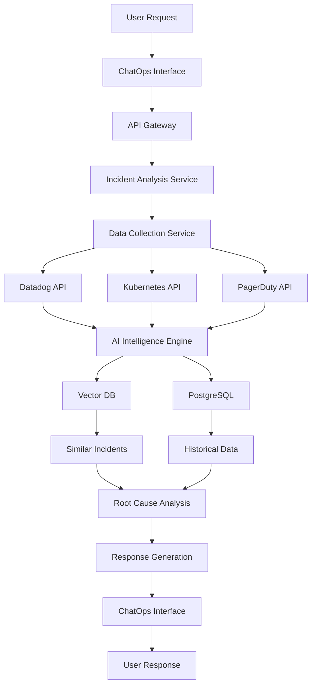

# High-Level Architecture (HLD)

##  System Overview

OpsSage is a microservices-based AI-powered incident management system designed to reduce MTTR through intelligent automation and real-time analysis.

##  Core Components

### 1. ChatOps Interface Layer
```
┌─────────────────────────────────────────────────────────┐
│                ChatOps Interface Layer                  │
├─────────────────┬─────────────────┬─────────────────────┤
│   Slack Bot     │   Teams Bot     │   Web Dashboard     │
│                 │                 │                     │
│ • /incident     │ • /incident     │ • Incident UI       │
│ • Natural Lang  │ • Natural Lang  │ • Timeline View     │
│ • Quick Actions │ • Quick Actions │ • Metrics Dashboard │
└─────────────────┴─────────────────┴─────────────────────┘
```

### 2. API Gateway & Security
```
┌─────────────────────────────────────────────────────────┐
│              API Gateway & Security Layer               │
├─────────────────────────────────────────────────────────┤
│ • Authentication (OAuth 2.0, SAML)                     │
│ • Authorization (RBAC)                                  │
│ • Rate Limiting                                         │
│ • Request Validation                                    │
│ • Audit Logging                                         │
│ • API Key Management                                    │
└─────────────────────────────────────────────────────────┘
```

### 3. Core Services
```
┌─────────────────────────────────────────────────────────┐
│                   Core Services                          │
├─────────────────┬─────────────────┬─────────────────────┤
│   Incident      │   Data          │   AI Intelligence   │
│   Analysis      │   Collection    │   Engine            │
│   Service       │   Service       │                     │
│                 │                 │                     │
│ • Root Cause    │ • Log Aggregator│ • LLM Integration   │
│ • Timeline      │ • Metrics       │ • Embedding Gen     │
│ • Correlation   │ • Traces        │ • Similarity Search │
│ • Scoring       │ • Events        │ • Prompt Orchest    │
└─────────────────┴─────────────────┴─────────────────────┘
```

### 4. Knowledge Base
```
┌─────────────────────────────────────────────────────────┐
│                Knowledge Base Layer                     │
├─────────────────┬─────────────────┬─────────────────────┤
│   Vector DB     │   Relational    │   Cache Layer       │
│   (Pinecone)    │   (PostgreSQL)  │   (Redis)           │
│                 │                 │                     │
│ • Incident      │ • User Data     │ • Session Data      │
│   Embeddings    │ • Config        │ • API Responses     │
│ • Runbook       │ • Audit Logs    │ • Precomputed       │
│   Vectors       │ • Incidents     │   Analysis          │
└─────────────────┴─────────────────┴─────────────────────┘
```

### 5. Data Source Integrations
```
┌─────────────────────────────────────────────────────────┐
│              Data Source Connectors                     │
├─────────────────┬─────────────────┬─────────────────────┤
│   Observability │   Infrastructure│   Incident Mgmt     │
│                 │                 │                     │
│ • Datadog       │ • Kubernetes    │ • PagerDuty         │
│ • Prometheus    │ • AWS Cloud     │ • Opsgenie          │
│ • Grafana       │ • Azure         │ • ServiceNow        │
│ • Jaeger        │ • GCP           │                     │
└─────────────────┴─────────────────┴─────────────────────┘
```

##  Data Flow Architecture



##  Security Architecture

### Authentication & Authorization
```
┌─────────────────────────────────────────────────────────┐
│                Security Layer                            │
├─────────────────────────────────────────────────────────┤
│                                                         │
│  ┌─────────────┐  ┌─────────────┐  ┌─────────────┐     │
│  │   OAuth     │  │    RBAC     │  │   Audit     │     │
│  │   Provider  │  │   Engine    │  │   Logging   │     │
│  │             │  │             │  │             │     │
│  │ • Slack     │  │ • Roles     │  │ • API Calls │     │
│  │ • Teams     │  │ • Permissions│ │ • Data Access│     │
│  │ • SSO       │  │ • Resources │  │ • Changes   │     │
│  └─────────────┘  └─────────────┘  └─────────────┘     │
│                                                         │
└─────────────────────────────────────────────────────────┘
```

### Data Protection
- **Encryption at Rest**: AES-256 for all databases
- **Encryption in Transit**: TLS 1.3 for all API calls
- **Data Masking**: Automatic PII detection and masking
- **Compliance**: GDPR, SOC 2, HIPAA ready

##  Scalability Architecture

### Horizontal Scaling
```
┌─────────────────────────────────────────────────────────┐
│                Load Balancer Layer                       │
├─────────────────────────────────────────────────────────┤
│                                                         │
│  ┌─────────────┐  ┌─────────────┐  ┌─────────────┐     │
│  │   Service   │  │   Service   │  │   Service   │     │
│  │   Instance  │  │   Instance  │  │   Instance  │     │
│  │     #1      │  │     #2      │  │     #N      │     │
│  └─────────────┘  └─────────────┘  └─────────────┘     │
│                                                         │
└─────────────────────────────────────────────────────────┘
```

### Auto-scaling Policies
- **CPU Utilization**: Scale up at 70%, scale down at 30%
- **Memory Usage**: Scale up at 80%, scale down at 40%
- **Request Queue**: Scale up when queue > 100 requests
- **Time-based**: Scale up during business hours

##  Technology Stack Details

### Backend Services
- **Framework**: NestJS (Node.js)
- **Language**: TypeScript
- **Database**: PostgreSQL 14+
- **Cache**: Redis 7+
- **Message Queue**: RabbitMQ/Apache Kafka
- **Search**: Elasticsearch/OpenSearch

### AI/ML Components
- **LLM**: OpenAI GPT-4 / Azure OpenAI
- **Embeddings**: OpenAI text-embedding-ada-002
- **Vector DB**: Pinecone / Weaviate
- **ML Pipeline**: TensorFlow / PyTorch (optional)

### Infrastructure
- **Container**: Docker
- **Orchestration**: Kubernetes
- **Service Mesh**: Istio
- **Monitoring**: Prometheus + Grafana
- **Logging**: ELK Stack

##  Deployment Architecture

### Kubernetes Cluster Layout
```
┌─────────────────────────────────────────────────────────┐
│                Production Cluster                        │
├─────────────────────────────────────────────────────────┤
│                                                         │
│  ┌─────────────┐  ┌─────────────┐  ┌─────────────┐     │
│  │   Web       │  │   API       │  │   Worker    │     │
│  │   Tier      │  │   Tier      │  │   Tier      │     │
│  └─────────────┘  └─────────────┘  └─────────────┘     │
│                                                         │
│  ┌─────────────┐  ┌─────────────┐  ┌─────────────┐     │
│  │   Data      │  │   AI        │  │   Monitoring│     │
│  │   Layer     │  │   Layer     │  │   Layer     │     │
│  └─────────────┘  └─────────────┘  └─────────────┘     │
│                                                         │
└─────────────────────────────────────────────────────────┘
```

### Environment Strategy
- **Development**: Minikube / Kind
- **Staging**: GKE / EKS / AKS (small cluster)
- **Production**: Multi-region GKE / EKS / AKS
- **Disaster Recovery**: Cross-region replication

##  Performance Requirements

### Response Time SLAs
- **Chat Response**: < 2 seconds
- **Incident Analysis**: < 30 seconds
- **Data Retrieval**: < 5 seconds
- **Similarity Search**: < 1 second

### Throughput Targets
- **Concurrent Users**: 1000+
- **Incidents/Day**: 10,000+
- **API Requests/Second**: 5000+
- **Data Points/Second**: 100,000+

##  High Availability Design

### Redundancy Strategy
- **Multi-AZ Deployment**: 3+ availability zones
- **Database Replication**: Primary + 2 read replicas
- **Cache Clustering**: Redis Cluster with failover
- **Load Balancing**: Multiple ALBs with health checks

### Disaster Recovery
- **RTO**: 15 minutes
- **RPO**: 5 minutes
- **Backup Strategy**: Continuous backup to S3
- **Failover Testing**: Monthly drills
