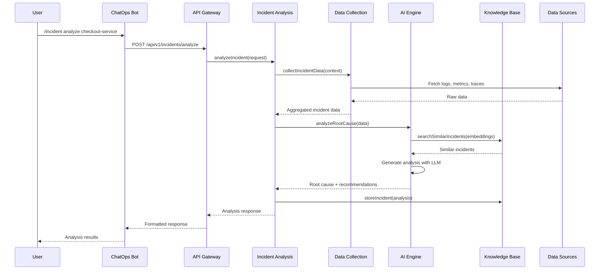

# Low-Level Design (LLD)

##  Service Breakdown

### 1. Incident Analysis Service

```typescript
// Service Structure
class IncidentAnalysisService {
  private dataCollector: DataCollectionService;
  private aiEngine: AIIntelligenceEngine;
  private knowledgeBase: KnowledgeBaseService;
  
  async analyzeIncident(request: IncidentAnalysisRequest): Promise<IncidentAnalysisResponse> {
    // 1. Collect relevant data
    // 2. Generate embeddings
    // 3. Search similar incidents
    // 4. Perform root cause analysis
    // 5. Generate recommendations
  }
}
```

**Responsibilities:**
- Orchestrate incident analysis workflow
- Coordinate between data collection and AI engine
- Generate incident timelines
- Calculate confidence scores
- Format responses for ChatOps interfaces

### 2. Data Collection Service

```typescript
// Data Collection Architecture
class DataCollectionService {
  private collectors: Map<string, DataCollector>;
  
  constructor() {
    this.collectors.set('datadog', new DatadogCollector());
    this.collectors.set('kubernetes', new KubernetesCollector());
    this.collectors.set('pagerduty', new PagerDutyCollector());
  }
  
  async collectIncidentData(context: IncidentContext): Promise<IncidentData> {
    const promises = context.dataSources.map(source => 
      this.collectors.get(source)?.collect(context)
    );
    
    const results = await Promise.allSettled(promises);
    return this.aggregateResults(results);
  }
}
```

**Data Collectors:**
- **DatadogCollector**: Logs, metrics, traces
- **KubernetesCollector**: Pod status, events, deployments
- **PagerDutyCollector**: Incident timelines, escalations
- **CICDCollector**: Recent deployments, pipeline status

### 3. AI Intelligence Engine

```typescript
// AI Engine Architecture
class AIIntelligenceEngine {
  private llmClient: LLMClient;
  private embeddingService: EmbeddingService;
  private vectorDB: VectorDatabase;
  
  async analyzeRootCause(data: IncidentData): Promise<RootCauseAnalysis> {
    // 1. Generate embeddings for incident data
    const embeddings = await this.embeddingService.generate(data);
    
    // 2. Search for similar incidents
    const similarIncidents = await this.vectorDB.search(embeddings, 10);
    
    // 3. Construct analysis prompt
    const prompt = this.buildAnalysisPrompt(data, similarIncidents);
    
    // 4. Generate root cause analysis
    const analysis = await this.llmClient.complete(prompt);
    
    return this.parseAnalysisResponse(analysis);
  }
}
```

### 4. Knowledge Base Service

```typescript
// Knowledge Base Architecture
class KnowledgeBaseService {
  private vectorDB: VectorDatabase;
  private relationalDB: RelationalDatabase;
  private cache: CacheService;
  
  async storeIncident(incident: Incident): Promise<void> {
    // 1. Store in relational DB
    await this.relationalDB.store(incident);
    
    // 2. Generate and store embeddings
    const embeddings = await this.generateEmbeddings(incident);
    await this.vectorDB.store(incident.id, embeddings);
    
    // 3. Update cache
    await this.cache.invalidate(`incident:${incident.id}`);
  }
}
```

##  Detailed Data Flow

### Incident Analysis Flow



### Similar Incident Detection Flow

```mermaid
sequenceDiagram
    participant AI as AI Engine
    participant Embed as Embedding Service
    participant Vector as Vector DB
    incident as New Incident
    
    incident->>AI: Analyze incident
    AI->>Embed: Generate embeddings
    
    Embed->>Embed: Extract features:
        - Error patterns
        - Service names
        - Time patterns
        - Metrics anomalies
    
    Embed-->>AI: 1536-dim vector
    
    AI->>Vector: Search similar vectors
    Vector->>Vector: Cosine similarity search
    Vector-->>AI: Top 10 similar incidents
    
    AI->>AI: Calculate confidence scores
    AI->>AI: Generate: "Similar incident 2 weeks ago → Root cause: memory leak"
```

##  Service Communication

### Internal API Contracts

```typescript
// Data Collection Contract
interface DataCollectionRequest {
  timeRange: {
    start: Date;
    end: Date;
  };
  services: string[];
  severity: 'low' | 'medium' | 'high' | 'critical';
  dataTypes: ('logs' | 'metrics' | 'traces' | 'events')[];
}

interface IncidentData {
  logs: LogEntry[];
  metrics: MetricData[];
  traces: TraceData[];
  events: KubernetesEvent[];
  deployments: DeploymentInfo[];
}

// AI Engine Contract
interface RootCauseAnalysis {
  hypothesis: string;
  confidence: number; // 0-100
  evidence: EvidenceItem[];
  similarIncidents: SimilarIncident[];
  recommendations: Recommendation[];
  timeline: IncidentTimeline[];
}

interface SimilarIncident {
  id: string;
  timestamp: Date;
  similarity: number; // 0-100
  rootCause: string;
  resolution: string;
}
```

### Message Queue Architecture

```typescript
// Async Communication
interface IncidentEvent {
  id: string;
  type: 'incident.created' | 'incident.updated' | 'incident.resolved';
  data: IncidentData;
  timestamp: Date;
}

// Event Bus
class EventBus {
  async publish(event: IncidentEvent): Promise<void> {
    await this.messageQueue.publish('incidents', event);
  }
  
  async subscribe(pattern: string, handler: EventHandler): Promise<void> {
    await this.messageQueue.subscribe(pattern, handler);
  }
}
```

##  Database Design

### PostgreSQL Schema

```sql
-- Incidents Table
CREATE TABLE incidents (
    id UUID PRIMARY KEY DEFAULT gen_random_uuid(),
    title VARCHAR(255) NOT NULL,
    description TEXT,
    severity VARCHAR(20) NOT NULL,
    status VARCHAR(20) NOT NULL,
    service_name VARCHAR(100) NOT NULL,
    created_at TIMESTAMP WITH TIME ZONE DEFAULT NOW(),
    updated_at TIMESTAMP WITH TIME ZONE DEFAULT NOW(),
    resolved_at TIMESTAMP WITH TIME ZONE,
    assigned_to UUID REFERENCES users(id),
    metadata JSONB
);

-- Root Causes Table
CREATE TABLE root_causes (
    id UUID PRIMARY KEY DEFAULT gen_random_uuid(),
    incident_id UUID NOT NULL REFERENCES incidents(id),
    hypothesis TEXT NOT NULL,
    confidence INTEGER NOT NULL CHECK (confidence >= 0 AND confidence <= 100),
    evidence JSONB,
    created_at TIMESTAMP WITH TIME ZONE DEFAULT NOW()
);

-- Recommendations Table
CREATE TABLE recommendations (
    id UUID PRIMARY KEY DEFAULT gen_random_uuid(),
    incident_id UUID NOT NULL REFERENCES incidents(id),
    type VARCHAR(50) NOT NULL, -- 'runbook', 'action', 'investigation'
    title VARCHAR(255) NOT NULL,
    description TEXT,
    priority INTEGER NOT NULL DEFAULT 1,
    auto_executable BOOLEAN DEFAULT FALSE,
    created_at TIMESTAMP WITH TIME ZONE DEFAULT NOW()
);

-- Users and RBAC
CREATE TABLE users (
    id UUID PRIMARY KEY DEFAULT gen_random_uuid(),
    email VARCHAR(255) UNIQUE NOT NULL,
    name VARCHAR(255) NOT NULL,
    role VARCHAR(50) NOT NULL,
    permissions JSONB,
    created_at TIMESTAMP WITH TIME ZONE DEFAULT NOW()
);
```

### Vector Database Schema

```typescript
// Pinecone/Weaviate Schema
interface IncidentVector {
  id: string; // incident UUID
  values: number[]; // 1536-dimensional embedding
  metadata: {
    title: string;
    service: string;
    severity: string;
    timestamp: number;
    rootCause: string;
    tags: string[];
  };
}
```

##  Implementation Details

### Error Handling Strategy

```typescript
// Circuit Breaker Pattern
class ResilientDataCollector {
  private circuitBreaker: CircuitBreaker;
  
  async collectData(request: DataRequest): Promise<Data> {
    return this.circuitBreaker.execute(async () => {
      try {
        return await this.actualCollect(request);
      } catch (error) {
        this.logger.error('Data collection failed', error);
        throw new DataCollectionError(error.message);
      }
    });
  }
}

// Retry with Exponential Backoff
class RetryableOperation {
  async execute<T>(
    operation: () => Promise<T>,
    maxRetries: number = 3
  ): Promise<T> {
    for (let attempt = 1; attempt <= maxRetries; attempt++) {
      try {
        return await operation();
      } catch (error) {
        if (attempt === maxRetries) throw error;
        
        const delay = Math.pow(2, attempt) * 1000;
        await this.sleep(delay);
      }
    }
  }
}
```

### Caching Strategy

```typescript
// Multi-level Caching
class CacheManager {
  private l1Cache: MemoryCache; // 5 minutes
  private l2Cache: RedisCache;  // 1 hour
  private l3Cache: Database;    // Persistent
  
  async get<T>(key: string): Promise<T | null> {
    // L1: Memory cache
    let value = await this.l1Cache.get<T>(key);
    if (value) return value;
    
    // L2: Redis cache
    value = await this.l2Cache.get<T>(key);
    if (value) {
      await this.l1Cache.set(key, value, 300); // 5 minutes
      return value;
    }
    
    // L3: Database
    value = await this.l3Cache.get<T>(key);
    if (value) {
      await this.l2Cache.set(key, value, 3600); // 1 hour
      await this.l1Cache.set(key, value, 300);
      return value;
    }
    
    return null;
  }
}
```

##  Performance Optimization

### Database Optimization

```sql
-- Indexes for Performance
CREATE INDEX idx_incidents_service_severity ON incidents(service_name, severity);
CREATE INDEX idx_incidents_created_at ON incidents(created_at DESC);
CREATE INDEX idx_root_causes_incident_id ON root_causes(incident_id);
CREATE INDEX idx_recommendations_incident_id ON recommendations(incident_id);

-- Partitioning for Large Tables
CREATE TABLE incidents_2024_01 PARTITION OF incidents
FOR VALUES FROM ('2024-01-01') TO ('2024-02-01');
```

### Vector Search Optimization

```typescript
// Hybrid Search Strategy
class OptimizedVectorSearch {
  async searchSimilarIncidents(
    queryEmbedding: number[],
    filters: SearchFilters
  ): Promise<SimilarIncident[]> {
    // 1. Pre-filter with metadata
    const candidateIds = await this.preFilter(filters);
    
    // 2. Vector search on candidates only
    const vectorResults = await this.vectorDB.search(
      queryEmbedding,
      { filter: { id: { $in: candidateIds } } }
    );
    
    // 3. Re-rank with custom scoring
    return this.reRankResults(vectorResults, filters);
  }
}
```

##  Security Implementation

### API Security

```typescript
// Authentication Middleware
@Injectable()
export class AuthMiddleware implements NestMiddleware {
  async use(req: Request, res: Response, next: NextFunction) {
    const token = this.extractToken(req);
    
    if (!token) {
      throw new UnauthorizedException('No token provided');
    }
    
    const payload = await this.jwtService.verify(token);
    const user = await this.userService.findById(payload.sub);
    
    if (!user || !this.hasPermission(user, req.route.path, req.method)) {
      throw new ForbiddenException('Insufficient permissions');
    }
    
    req.user = user;
    next();
  }
}

// Rate Limiting
@Injectable()
export class RateLimitGuard {
  async canActivate(context: ExecutionContext): Promise<boolean> {
    const request = context.switchToHttp().getRequest();
    const key = `rate_limit:${request.user.id}:${request.path}`;
    
    const current = await this.redis.incr(key);
    if (current === 1) {
      await this.redis.expire(key, 60); // 1 minute window
    }
    
    if (current > 100) { // 100 requests per minute
      throw new ThrottlerException('Rate limit exceeded');
    }
    
    return true;
  }
}
```

### Data Masking

```typescript
// PII Detection and Masking
class DataMaskingService {
  private piiPatterns = [
    /\b\d{4}[-\s]?\d{4}[-\s]?\d{4}[-\s]?\d{4}\b/g, // Credit cards
    /\b[A-Za-z0-9._%+-]+@[A-Za-z0-9.-]+\.[A-Z|a-z]{2,}\b/g, // Emails
    /\b\d{3}-\d{2}-\d{4}\b/g // SSN
  ];
  
  maskSensitiveData(text: string): string {
    let masked = text;
    
    for (const pattern of this.piiPatterns) {
      masked = masked.replace(pattern, '[REDACTED]');
    }
    
    return masked;
  }
}
```

##  Monitoring & Observability

### Metrics Collection

```typescript
// Custom Metrics
class MetricsCollector {
  private counter = new Counter({
    name: 'incident_analysis_total',
    help: 'Total number of incident analyses',
    labelNames: ['service', 'severity']
  });
  
  private histogram = new Histogram({
    name: 'incident_analysis_duration_seconds',
    help: 'Duration of incident analysis',
    labelNames: ['service'],
    buckets: [1, 5, 10, 30, 60, 300]
  });
  
  recordAnalysis(service: string, severity: string, duration: number): void {
    this.counter.labels(service, severity).inc();
    this.histogram.labels(service).observe(duration);
  }
}
```

### Distributed Tracing

```typescript
// OpenTelemetry Integration
class TracingService {
  async traceIncidentAnalysis(
    incidentId: string,
    operation: () => Promise<any>
  ): Promise<any> {
    const span = this.tracer.startSpan(`incident-analysis-${incidentId}`);
    
    try {
      span.setAttributes({
        'incident.id': incidentId,
        'operation.name': 'analyze'
      });
      
      const result = await operation();
      
      span.setStatus({ code: SpanStatusCode.OK });
      return result;
    } catch (error) {
      span.recordException(error);
      span.setStatus({ code: SpanStatusCode.ERROR });
      throw error;
    } finally {
      span.end();
    }
  }
}
```
