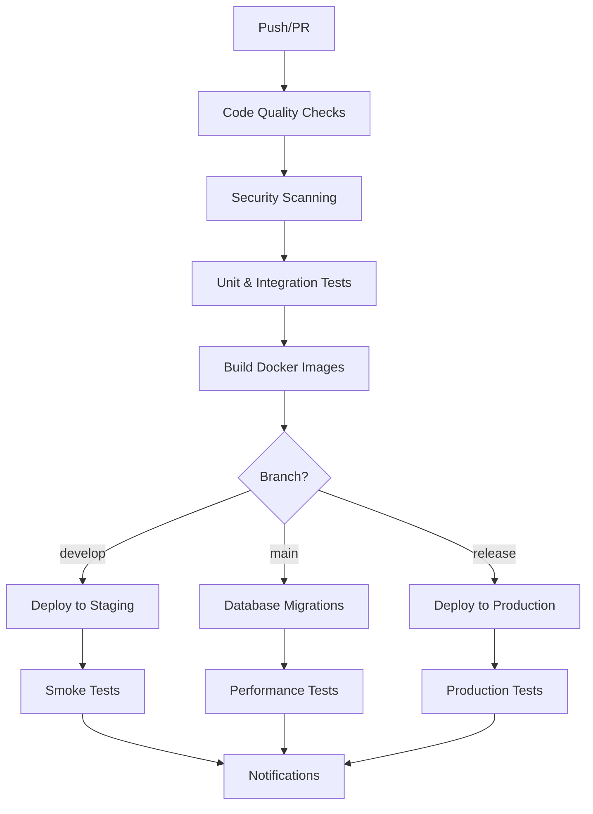

# CI/CD Pipeline Design

##  Overview

OpsSage uses a comprehensive CI/CD pipeline built with GitHub Actions to ensure code quality, security, and reliable deployments across multiple environments.

##  Pipeline Architecture



##  Pipeline Stages

### 1. Code Quality & Testing

**Purpose**: Ensure code quality and functionality before deployment

**Steps**:
- **Linting**: ESLint + Prettier for code consistency
- **Type Checking**: TypeScript strict mode compliance
- **Unit Tests**: Jest with 90%+ coverage requirement
- **Integration Tests**: API endpoint testing with real services
- **Security Audit**: npm audit for vulnerability detection
- **SAST Scan**: Static analysis security testing

**Configuration**:
```yaml
test:
  strategy:
    matrix:
      node-version: [18.x, 20.x]
  timeout-minutes: 15
  env:
    NODE_ENV: test
    COVERAGE_THRESHOLD: 90
```

### 2. Security Scanning

**Purpose**: Identify and prevent security vulnerabilities

**Tools**:
- **Trivy**: Container vulnerability scanning
- **npm audit**: Dependency vulnerability detection
- **TruffleHog**: Secret detection in code
- **CodeQL**: Advanced static analysis

**Security Policies**:
```yaml
security:
  fail_on_vulnerabilities: true
  vulnerability_threshold: medium
  secret_detection: strict
  container_scan: true
```

### 3. Build & Package

**Purpose**: Build containerized applications with reproducibility

**Features**:
- **Multi-platform builds**: Linux AMD64/ARM64 support
- **Layer caching**: GitHub Actions cache for faster builds
- **SBOM generation**: Software Bill of Materials for transparency
- **Image signing**: Content trust for production images

**Build Matrix**:
```yaml
build:
  matrix:
    service: [api-gateway, incident-analysis, data-collection, ai-engine]
    platform: [linux/amd64, linux/arm64]
```

### 4. Deployment Strategy

#### Staging Deployment

**Trigger**: Push to `develop` branch
**Environment**: Kubernetes staging cluster
**Strategy**: Blue-Green deployment with zero downtime

```yaml
deploy-staging:
  environment: staging
  strategy:
    type: blue_green
    wait_for_rollout: true
    health_check_timeout: 300
```

#### Production Deployment

**Trigger**: GitHub release creation
**Environment**: Kubernetes production cluster
**Strategy**: Canary deployment with gradual traffic shift

```yaml
deploy-production:
  environment: production
  strategy:
    type: canary
    canary_percentage: 10
    canary_duration: 300
    auto_promotion: true
```

## 🧪 Testing Strategy

### Test Pyramid

```
    /\
   /  \  E2E Tests (5%)
  /____\
 /      \
/        \ Integration Tests (25%)
\________/
\        /
 \______/ Unit Tests (70%)
```

### Test Types

#### Unit Tests
- **Framework**: Jest + Supertest
- **Coverage**: 90% minimum requirement
- **Mocking**: All external dependencies
- **Runtime**: < 5 minutes

```javascript
// Example unit test
describe('Incident Analysis Service', () => {
  it('should analyze incident correctly', async () => {
    const mockData = createMockIncidentData();
    const result = await incidentService.analyze(mockData);
    
    expect(result.rootCause.hypothesis).toBeDefined();
    expect(result.confidence).toBeGreaterThan(70);
  });
});
```

#### Integration Tests
- **Framework**: Jest + Testcontainers
- **Database**: Real PostgreSQL instance
- **External APIs**: Mocked with WireMock
- **Runtime**: < 15 minutes

```javascript
// Example integration test
describe('API Integration', () => {
  let testContainer;
  
  beforeAll(async () => {
    testContainer = await new PostgreSQLContainer().start();
  });
  
  it('should handle complete incident analysis flow', async () => {
    const response = await request(app)
      .post('/api/v1/incidents/analyze')
      .send(testIncident)
      .expect(200);
    
    expect(response.body.analysis.rootCause).toBeDefined();
  });
});
```

#### Performance Tests
- **Tool**: Artillery.js
- **Metrics**: Response time, throughput, error rate
- **Scenarios**: Peak load, stress, endurance
- **Thresholds**: SLA-based pass/fail criteria

```yaml
# Artillery config
config:
  target: 'https://api.opssage.io'
  phases:
    - duration: 60
      arrivalRate: 10
    - duration: 120
      arrivalRate: 50
    - duration: 60
      arrivalRate: 100
```

#### E2E Tests
- **Framework**: Playwright
- **Browsers**: Chrome, Firefox, Safari
- **Scenarios**: Complete user journeys
- **Runtime**: < 30 minutes

## 🔒 Security Integration

### Security Gates

1. **Pre-commit**: Local hooks for basic validation
2. **Pre-push**: Automated security scanning
3. **Pre-deploy**: Comprehensive security assessment
4. **Post-deploy**: Runtime security monitoring

### Security Tools Configuration

```yaml
security:
  tools:
    trivy:
      severity: HIGH,CRITICAL
      ignore_unfixed: false
    
    npm_audit:
      audit_level: moderate
      production_only: true
    
    codeql:
      queries: security-and-quality
      timeout: 30m
```

### Secret Management

```yaml
secrets:
  management:
    provider: GitHub Secrets
    rotation: quarterly
    access: role-based
    audit: enabled
```

##  Monitoring & Observability

### Deployment Monitoring

```yaml
monitoring:
  deployment:
    health_checks:
      - endpoint: /health
        timeout: 30
        interval: 10
    
    metrics:
      - deployment_duration
      - rollback_count
      - error_rate
      - response_time
    
    alerts:
      - deployment_failure
      - high_error_rate
      - slow_response_time
```

### Performance Monitoring

```yaml
performance:
  sla:
    response_time_p95: 1000ms
    response_time_p99: 2000ms
    error_rate: 0.1%
    availability: 99.9%
  
  benchmarks:
    load_test: 1000 req/s
    stress_test: 5000 req/s
    endurance_test: 24h
```

##  Environment Management

### Environment Configuration

```yaml
environments:
  development:
    replicas: 1
    resources:
      memory: 256Mi
      cpu: 250m
    monitoring: basic
    
  staging:
    replicas: 2
    resources:
      memory: 512Mi
      cpu: 500m
    monitoring: full
    
  production:
    replicas: 3
    resources:
      memory: 1Gi
      cpu: 1000m
    monitoring: full
    backup: enabled
```

### Configuration Management

```yaml
config:
  management:
    tool: Helm
    values_files:
      - values.yaml
      - environments/${ENVIRONMENT}.yaml
      - secrets/${ENVIRONMENT}.yaml
    
  validation:
    schema: true
    values: true
    templates: true
```

##  Rollback & Recovery

### Rollback Strategies

#### Immediate Rollback
- **Trigger**: Health check failures
- **Action**: Revert to previous deployment
- **Timeout**: 5 minutes

#### Gradual Rollback
- **Trigger**: Performance degradation
- **Action**: Reduce traffic to new version
- **Timeout**: 15 minutes

#### Manual Rollback
- **Trigger**: Manual intervention
- **Action**: Operator-initiated rollback
- **Timeout**: 30 minutes

### Recovery Procedures

```yaml
recovery:
  automated:
    health_check_failures: immediate_rollback
    performance_degradation: gradual_rollback
    security_vulnerabilities: emergency_rollback
  
  manual:
    approval_required: true
    rollback_command: helm rollback
    verification: smoke_tests
```

##  Performance Optimization

### Build Optimization

```yaml
optimization:
  build:
    docker_cache: true
    layer_caching: gha
    parallel_builds: true
    multi_platform: true
    
  dependencies:
    caching: npm
    deduplication: true
    security_updates: automated
```

### Deployment Optimization

```yaml
deployment:
  optimization:
    parallel_deployments: true
    resource_limits: optimized
    health_check_tuning: true
    rollout_strategy: progressive
```

##  Configuration Files

### GitHub Actions Workflow

```yaml
name: OpsSage CI/CD

on:
  push:
    branches: [main, develop]
  pull_request:
    branches: [main]
  release:
    types: [published]

env:
  REGISTRY: ghcr.io
  IMAGE_NAME: ${{ github.repository }}

jobs:
  test:
    # ... test job configuration
  
  security:
    # ... security job configuration
  
  build:
    # ... build job configuration
  
  deploy-staging:
    # ... staging deployment configuration
  
  deploy-production:
    # ... production deployment configuration
```

### Helm Chart Configuration

```yaml
# Chart.yaml
apiVersion: v2
name: opssage
description: OpsSage - Intelligent Incident Copilot
type: application
version: 1.0.0
appVersion: "1.0.0"

# values.yaml
global:
  imageRegistry: ""
  imagePullSecrets: []
  storageClass: "fast-ssd"

services:
  apiGateway:
    replicaCount: 3
    resources:
      requests:
        memory: "256Mi"
        cpu: "250m"
      limits:
        memory: "512Mi"
        cpu: "500m"
```

##  Best Practices

### Code Quality
- **Maintain 90%+ test coverage**
- **Use TypeScript strict mode**
- **Implement comprehensive linting rules**
- **Regular code reviews with security focus**

### Security
- **Automated vulnerability scanning**
- **Secret detection in all commits**
- **Regular dependency updates**
- **Infrastructure as code security**

### Deployment
- **Zero-downtime deployments**
- **Comprehensive health checks**
- **Automated rollback capabilities**
- **Environment parity**

### Monitoring
- **Real-time deployment monitoring**
- **Performance SLA tracking**
- **Error rate alerting**
- **Resource utilization monitoring**

##  Success Metrics

### Development Metrics
- **Build time**: < 10 minutes
- **Test execution time**: < 15 minutes
- **Deployment time**: < 5 minutes
- **Code coverage**: > 90%

### Operational Metrics
- **Deployment success rate**: > 99%
- **Rollback rate**: < 1%
- **Mean Time to Recovery (MTTR)**: < 5 minutes
- **Service availability**: > 99.9%

### Security Metrics
- **Vulnerability remediation time**: < 24 hours
- **Security scan coverage**: 100%
- **Secret detection accuracy**: > 95%
- **Compliance adherence**: 100%

##  Continuous Improvement

### Pipeline Evolution
- **Regular performance reviews**
- **Tool evaluation and updates**
- **Process optimization**
- **Team feedback integration**

### Automation Enhancement
- **Increase test automation**
- **Improve deployment strategies**
- **Enhance monitoring capabilities**
- **Optimize resource usage**

This comprehensive CI/CD pipeline ensures that OpsSage maintains high quality, security, and reliability standards while enabling rapid and safe deployments across all environments.
